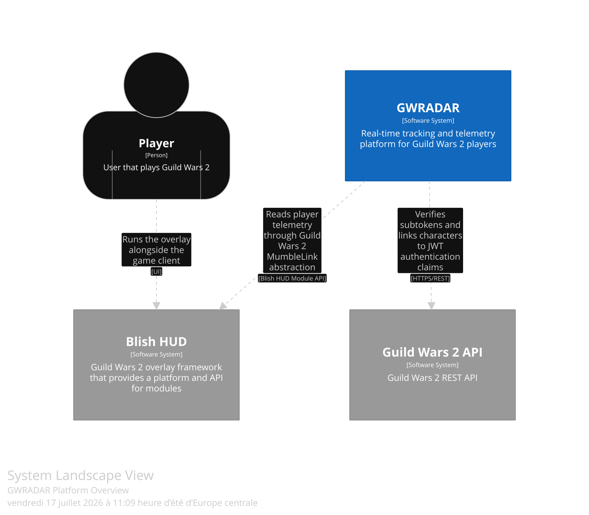
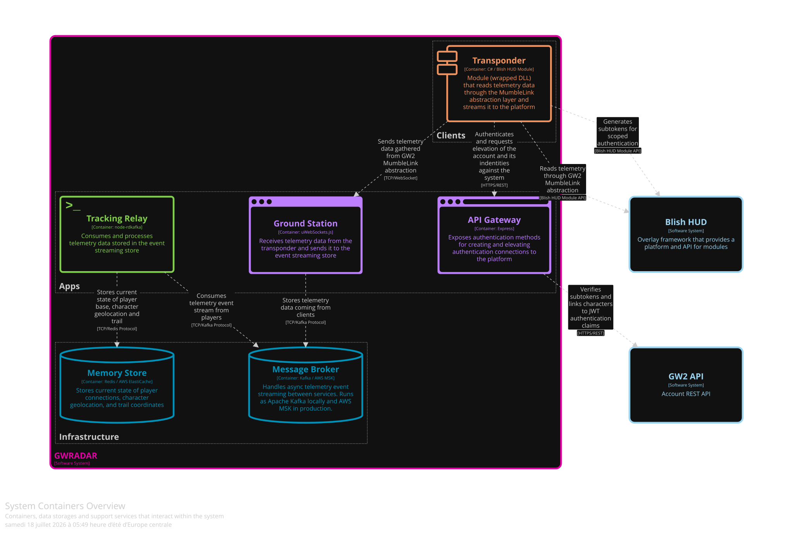
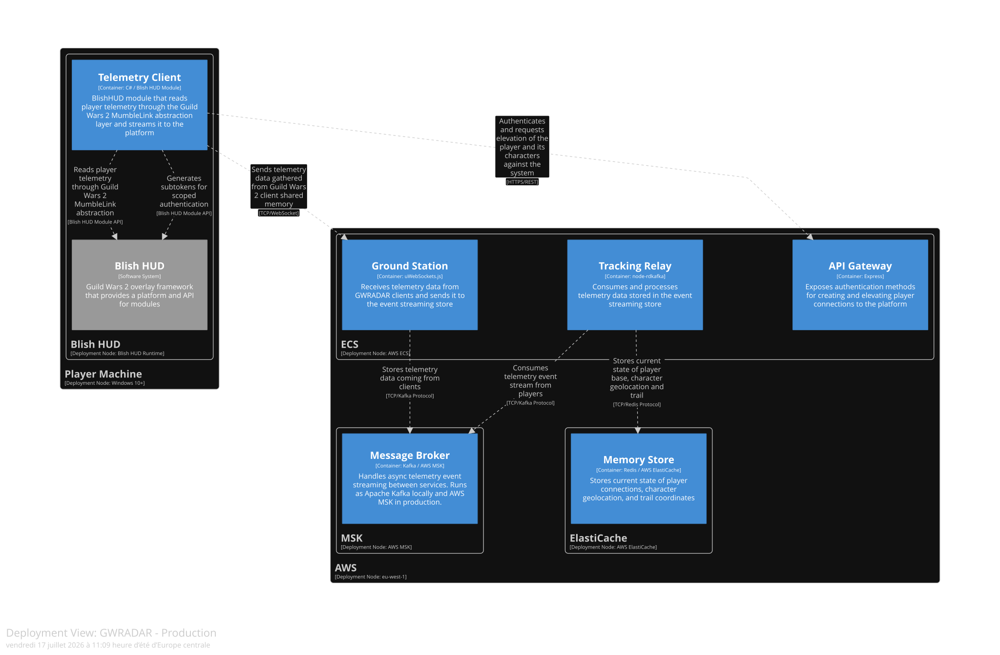

# GWRADAR

> A real-time tracking and telemetry platform for Guild Wars 2 players, providing map-based positioning through geolocation data.

---

## Table of Contents

- [Overview](#overview)
- [Architecture](#architecture)
    - [System Landscape](#system-landscape)
    - [System Context](#system-context)
    - [Containers](#containers)
    - [Deployment](#deployment)
    - [Architectural Pattern](#architectural-pattern)
- [Monorepo Structure](#monorepo-structure)
    - [Apps](#apps)
    - [Packages](#packages)
- [Infrastructure](#infrastructure)
    - [Local](#local)
    - [Production](#production)
- [Getting Started](#getting-started)
    - [Prerequisites](#prerequisites)
    - [Installation](#installation)
    - [Running Locally](#running-locally)
- [Environment Variables](#environment-variables)
- [Contributing](#contributing)

---

## Overview

GWRADAR tracks Guild Wars 2 players in real time by reading telemetry data from the game client via the [MumbleLink](https://wiki.guildwars2.com/wiki/API:MumbleLink) shared memory interface, abstracted through [Blish HUD](https://blishhud.com). This data is streamed to a backend platform that processes and relays player positions to provide live map-based tracking.

---

## Architecture

The full architecture is described using the [C4 model](https://c4model.com/).

### System Landscape

The system landscape shows GWRADAR in relation to the external systems it depends on.

| External System | Role |
|---|---|
| **Blish HUD** | Guild Wars 2 overlay framework that hosts the Telemetry Client module and abstracts the MumbleLink shared memory interface |
| **Guild Wars 2 API** | ArenaNet's REST API, used to verify player authentication subtokens and link characters to JWT claims |

---

### System Context

The system context shows how players interact with GWRADAR and its external dependencies.



---

### Containers

The container diagram shows the deployable units that make up the GWRADAR platform and how they communicate.



#### Apps

| Container | Technology | Description |
|---|---|---|
| **Ground Station** | Node.js / uWebSockets.js | Receives telemetry data from GWRADAR clients over WebSocket and publishes it to the event streaming store |
| **API Gateway** | Node.js / Express | Exposes authentication methods for creating and elevating player and character connections to the platform |
| **Tracking Relay** | Node.js / node-rdkafka | Consumes and processes telemetry events from the event streaming store and updates the current player state |

#### Clients

| Container | Technology | Description |
|---|---|---|
| **Telemetry Client** | C# / Blish HUD Module | Blish HUD module that reads player telemetry through the Guild Wars 2 MumbleLink abstraction layer and streams it to the platform |

#### Infrastructure

| Container | Technology | Description |
|---|---|---|
| **Message Broker** | Apache Kafka / AWS MSK | Handles async telemetry event streaming between services. Runs as Apache Kafka locally and AWS MSK in production |
| **Memory Store** | Redis / AWS ElastiCache | Stores the current state of player connections, character geolocation, and trail coordinates |

---

### Deployment

The production environment runs backend services on AWS and the Telemetry Client on the player's Windows machine via Blish HUD.



| Service | AWS Resource |
|---|---|
| Message Broker | AWS MSK (Managed Streaming for Apache Kafka) |
| Memory Store | AWS ElastiCache (Redis) |
| Backend Services | AWS ECS (Container Orchestration) |

---

### Architectural Pattern

Applications in this platform follow **Hexagonal Architecture**. Domain logic is isolated from infrastructure concerns through explicit port interfaces, with adapters providing concrete implementations.

---

## Monorepo Structure

This repository is managed with [Turborepo](https://turbo.build/repo).

```
.
├── apps/               # Deployable backend services
├── packages/           # Shared libraries and internal packages
└── docs/
    ├── diagrams/       # Exported architecture diagrams
```

### Apps

| App | Description |
|---|---|
| `apps/ground-station` | WebSocket server that ingests telemetry data from clients |
| `apps/api-gateway` | REST API for player authentication and session management |
| `apps/tracking-relay` | Kafka consumer that processes and relays telemetry events |

### Packages

| Package | Description |
|---|---|
| `packages/ports` | TypeScript interfaces defining domain contracts (driving and driven ports) |
| `packages/adapters` | Concrete adapter implementations for infrastructure (Kafka, Redis, HTTP, etc.) |
| `packages/config` | Shared configuration and build tooling |

---

## Infrastructure

### Local

Local development uses **Docker** to run all backend infrastructure and services.

### Production

Production runs on **AWS (eu-west-1)**:

| Service | AWS Resource |
|---|---|
| Message Broker | AWS MSK |
| Memory Store | AWS ElastiCache (Redis) |
| Container Orchestration | AWS ECS |

---

## Getting Started

### Prerequisites

- [Node.js](https://nodejs.org/) >= 18
- [pnpm](https://pnpm.io/)
- [Docker](https://www.docker.com/) (for local infrastructure)
- [Blish HUD](https://blishhud.com/) and [.NET SDK](https://dotnet.microsoft.com/) (for the Telemetry Client)
- Windows 10 or later (for running the Telemetry Client)

### Installation

```bash
git clone https://github.com/julianmejio/nevthol-node.git
cd nevthol-node
pnpm install
```

### Running Locally

```bash
# Start infrastructure and backend services
docker compose -f docker-compose.yml -f docker-compose.services.yml up -d

# Start GUI management interfaces for infrastructure
docker compose -f docker-compose.yml -f docker-compose.services.yml -f docker-compose.uis.yml up -d
```
By default, API gateway is exposed on port 3002, and Ground Station on port 9001.

For the Telemetry Client, install the compiled module in Blish HUD under the client machine.

---

## Environment Variables

Each app has its own `.env` file. Check `config.ts`file on every app to identify the variables that can be customized.

---

## Contributing

Contributions are welcome. Please open an issue before submitting a pull request so the change can be discussed first.

1. Fork the repository
2. Create a feature branch: `git checkout -b feat/your-feature`
3. Commit your changes following [Conventional Commits](https://www.conventionalcommits.org/): `git commit -m 'feat: add your feature'`
4. Push to the branch: `git push origin feat/your-feature`
5. Open a Pull Request
